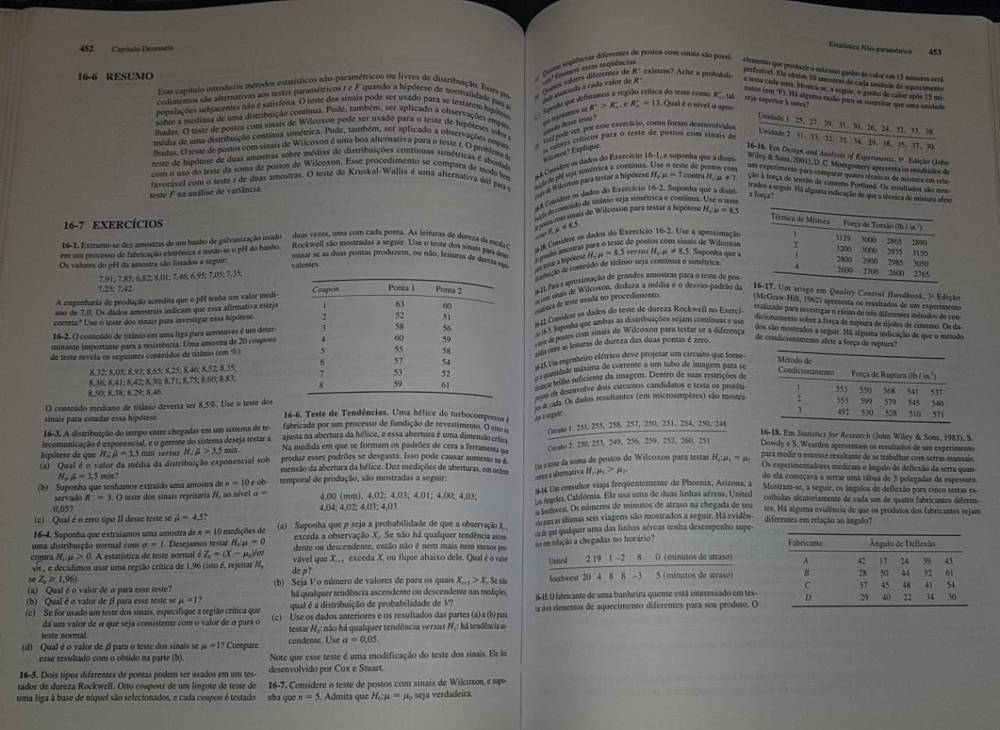

```{r setup, include=FALSE}
knitr::opts_chunk$set(echo = TRUE)
```

# P1

>- Teste binomial
>- Aproximação pela normal
>- Teste do quantil (binomial)
>- Teste do sinal
>- Wilcoxon

<!-- ## Binomial -->

<!-- Sobre proporção. -->

<!-- ## Sinais e Wilcoxon -->

<!-- Mediana de uma variável. Equivalente a formulação binomial (transformação na variável inicial. -->

<!-- Poder do teste na parte prática. -->

# Exercícios



## 1

Temos que,

$H_0:$ O pH tem um valor mediano de 7.

$H_1:$ O pH tem um valor mediano diferente de 7.

Formulação do Teste do Sinal

$H_0: p = 0.5$

$H_1: p \neq 0.5$

Seja $X_i$ os valores do pH na posição $i$

Temos que, T = +, se $X_i-7>0$ e -, se $X_i-7<0$ 

Definindo $T = $ número de sinais (+)

$T_{obs} = 8$

Temos que T ~ Bin(n=10, p=0.5)

Assim, 

```{r}
binom.test(x = 8, n = 10, p = 0.5, alternative = "two.sided")
```

Como o p-valor obtido foi de 0.1094, não rejeitamos $H_0$ há um nível de significância de 0.05 (5%). Ou seja, há evidências de que o pH tem um valor mediano de 7.

## 2 

Temos que,

$H_0:$ O conteúdo mediano de titânio é de 8.5%

$H_1:$ O conteúdo mediano de titânio é diferente de 8.5%

Formulação do Teste do Sinal

$H_0: p = 0.5$

$H_0: p \neq 0.5$

Seja $X_i$ os valores do conteúdo de titânio na posição $i$

Temos que, T = +, se $X_i-8.5>0$ e -, se $X_i-8.5<0$ 

Definindo $T = $ número de sinais (+)

$T_{obs} = 7$

Temos que T ~ Bin(n=19, p=0.5)

Para realização do Teste dos Sinais devemos descartar da amostra os valores que, sob $H_0$, forem nulos. Neste caso, temos um valor da amostra que é 8.5 e quando fazemos a diferença, sob $H_0$ (8.5 - 8.5 = 0), dá igual a 0.

Assim, 

```{r}
binom.test(x = 7, n = 19, p = 0.5, alternative = "two.sided")
```

Como o p-valor obtido foi de 0.3593, não rejeitamos $H_0$ há um nível de significância de 0.05 (5%). Ou seja, há evidências de que o conteúdo mediano de titânio é de 8.5%.

## 5

Temos que,

$H_0:$ As duas pontas produzem leituras de dureza equivalentes

$H_1:$ As duas pontas não produzem leituras de dureza equivalentes

Formulação do Teste do Sinal

$H_0: p = 0.5$

$H_0: p \neq 0.5$

Seja $X_i$ os valores da leitura da Ponta 1 e $Y_i$ da Ponta 2

Temos que, T = +, se $Xi - Yi > 0$, -, se $Xi - Yi < 0$

Definindo $T =$ número de sinais (+)

T ~ Bin(n=8, p=0.5)

## 13

```{r}
c1 = c(251, 255, 258, 257, 250, 251, 254, 250, 248)
c2 = c(250, 253, 249, 256, 259, 252, 260, 251, NA)
```

$H_0: \mu_1 = \mu_2$

$H_1: \mu_1 > \mu_2$


$H_0: p = 0.5$

$H_0: p > 0.5$

```{r}
wilcox.test(c1, c2, alternative = "greater", paired = T)
```

Calculando a EST. DO TESTE

```{r}
c1_c2 = c1-c2
c1_c2
```

Desconsiderando o valor faltante temos que n=8

```{r}
sort(abs(c1_c2))
```

<!-- Quando há repetição de valores (postos diferentes), devemos achar a média dos postos que tem os valores repetidos e associar o posto de cada valor repetido a média -->

<!-- Nesse caso, para 1 1 1 1 -->

<!-- m = (1+2+3+4)/4 = 2.5 -->

Quando temos valores repetidos nos postos, atribuimos a média da soma destes postos:

Pstos de 1 a 4

Soma destes postos = 1+2+3+4 = 10

Media desta soma = 2.5

Postos 7 e 8

Soma = 7+8 = 15

Media = 15/2 = 7.5

$R_+ = 2.5 + 2.5 + 5 + 7.5 = 17.5$

$R_- = 2.5 + 2.5 + 6 + 7.5 = 18.5$

APROX. NORMAL

$P(R \leq 17,5) =~ P(Z \leq (17.5-\mu)/\sigma) = P(Z \leq (17.5-18)/7.1 = P(Z \leq -0.07)$


