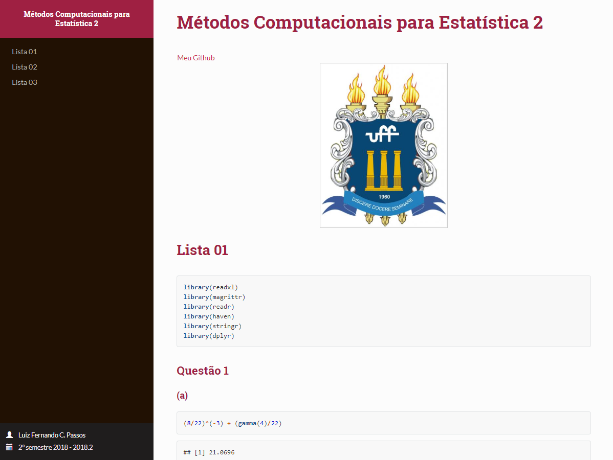

## Métodos Computacionais para Estatística II - UFF 

Resolução das listas enquanto cursava a disciplina Métodos Computacionais para Estatística II na Universidade Federal Fluminense, aulas ministradas pelo Prof. Dr. Jony Arrais. 

--- 

**ATENÇÃO!** AS LISTAS NÃO FORAM CORRIGIDAS PELO PROFESSOR.  

---

**HTML contendo todas as listas feitas**

---
