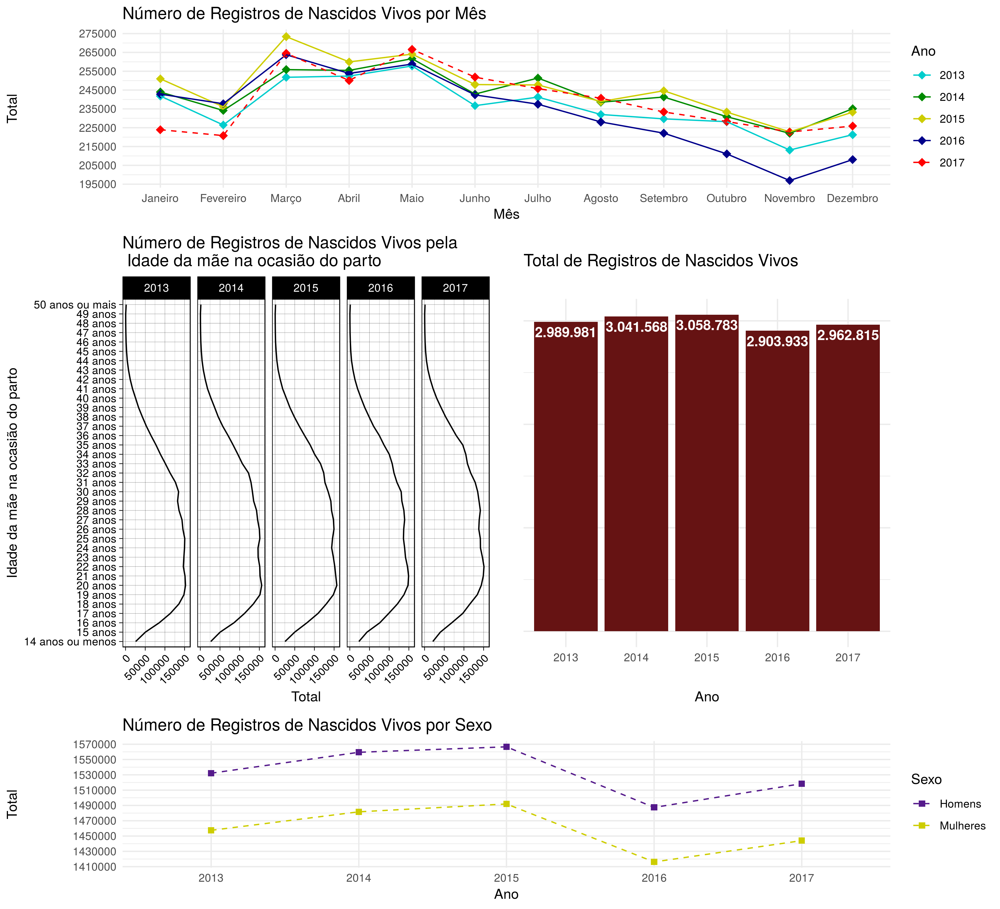

No gráfico intitulado *Número de Registros de Nascidos Vivos por Mês* pode-se perceber que 2017 teve o menor número de registros nos primeiros 2 meses em relação aos demais anos, já entre os meses de Julho e Dezembro, foi 2016 quem teve o menor número de registros em relação aos demais. Pode-se perceber também que os maiores números de registros de nascidos vivos para cada ano se concentram entre Março e Maio.

No gráfico *Número de Registros de Nascidos Vivos pela Idade da mãe na ocasião do parto* parece haver uma leve diminuição no número de registros para a idade das mães com 14 anos ou menos e um leve aumento no número de registros para a idade das mães entre 34 e 41 anos.

A respeito do gráfico *Total de Registro de Nascidos Vivos* é perceptível um aumento no número total de registros entre os anos de 2013 e 2015, tendo um pico em 2015 quando obteve o maior número total em relação aos demais anos, mesmo com o aumento do número total de 2017 em relação a 2016, o número total de registros neste último ano ainda é menor se comparado com os anos de 2013, 2014 e 2015. 

Finalizando, o gráfico *Número de Registros de Nascidos Vivos por Sexo* deixa claro que o número de registros da categoria Homens é superior ao número de Mulheres em todos os anos. Pode-se notar também um comportamento similar ao gráfico *Total de Registro de Nascidos Vivos*, tendo pico também em 2015.