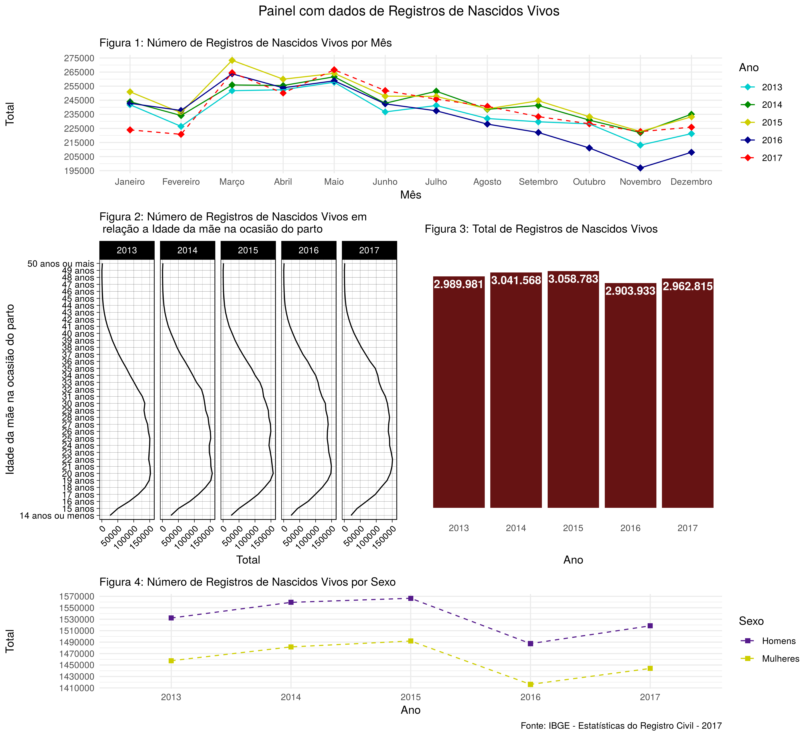

### Código

```{r eval=FALSE, message=FALSE, warning=FALSE}
# Figura 1

rnv_mes <-
  data_rnv_mes %>% 
  ggplot(aes(mes, Total, color = Ano)) +
  geom_point(shape = 18, size = 3) +
  geom_line(aes(group = Ano, linetype = Ano), size = 0.5) +
  scale_linetype_manual(values = c(rep("solid", 4), "dashed")) +
  scale_color_manual(values = c("cyan3", "green4", "yellow3", "darkblue", "red")) +
  scale_y_continuous(breaks = seq(195000, 275000, 10000)) +
  labs(x = "Mês") +
  theme_minimal()

# Figura 2

rnv_idade_mae <-
  data_rnv_idade_mae %>% 
  ggplot(aes(x = `Registros de nascidos vivos`, y = Total)) +
  geom_line(aes(group = Ano)) +
  facet_grid(~ Ano, switch = 'y') +
  theme_linedraw() +
  coord_flip() +
  theme(axis.text.x = element_text(angle = 45, vjust = 1, hjust = 1)) +
  labs(x = "Idade da mãe na ocasião do parto")

# Figura 3

rnv_total <- 
  data_rnv_total %>% 
  ggplot(aes(Ano, Total)) +
  geom_bar(fill = "#661313", stat = 'identity') +
  geom_text(aes(label = comma(Total, big.mark = ".", decimal.mark = ",")), 
            nudge_y = -99000, col = "white", fontface = "bold") +
  theme_minimal() +
  theme(axis.text.y = element_blank(),
        panel.grid.major = element_blank(),
        panel.grid.minor = element_blank()) +
  labs(y = "")

# Figura 4

rnv_sexo <-
  data_rnv_sexo %>% 
  ggplot(aes(x = Ano, y = Total, color = Sexo)) +
  geom_point(shape = 15, size = 2) +
  geom_line(aes(group = Sexo), linetype = "dashed", size = 0.5) +
  scale_color_manual(values = c("purple4", "yellow3")) +
  scale_y_continuous(breaks = seq(1410000, 1570000, 20000)) +
  theme_minimal()

# Painel

rnv_mes +
  labs(
    title = "Painel com dados de Registros de Nascidos Vivos \n",
    subtitle = "Número de Registros de Nascidos Vivos por Mês"
  ) +
  theme(plot.title = element_text(hjust = 0.5)) +
  {
    rnv_idade_mae + labs(subtitle = "Número de Registros de Nascidos Vivos pela \n 
                         Idade da mãe na ocasião do parto") +
      {
        rnv_total + labs(subtitle = "Total de Registros de Nascidos Vivos")
      } +
      patchwork::plot_layout(ncol = 2)
  } +
  {
    rnv_sexo + 
      labs(subtitle = "Número de Registros de Nascidos Vivos por Sexo",
           caption = "Fonte: IBGE - Estatísticas do Registro Civil - 2017"
      )
  } +
  plot_layout(ncol = 1, heights = c(1, 2.2, 0.8))
```

### Resultados



### Conclusão

Na figura 1, intitulado *Número de Registros de Nascidos Vivos por Mês*, pode-se perceber que 2017 teve o menor número de registros nos primeiros 2 meses em relação aos demais anos, já entre os meses de Julho e Dezembro, foi 2016 quem teve o menor número de registros em relação aos demais. Pode-se perceber também que os maiores números de registros de nascidos vivos para cada ano se concentram entre Março e Maio.

Na figura 2, *Número de Registros de Nascidos Vivos pela Idade da mãe na ocasião do parto*, parece haver uma leve diminuição no número de registros para a idade das mães com 14 anos ou menos e um leve aumento no número de registros para a idade das mães entre 34 e 41 anos.

A respeito da figura 3, *Total de Registro de Nascidos Vivos*, percebe-se um aumento no número total de registros entre os anos de 2013 e 2015, tendo um pico em 2015 quando obteve o maior número total em relação aos demais anos, mesmo com o aumento do número total de 2017 em relação a 2016, o número total de registros neste último ano ainda é menor se comparado com os anos de 2013, 2014 e 2015. 

Finalizando, a figura 4, *Número de Registros de Nascidos Vivos por Sexo*, deixa claro que o número de registros da categoria Homens é superior ao número de Mulheres em todos os anos. Pode-se notar também um comportamento similar ao gráfico *Total de Registro de Nascidos Vivos*, tendo pico também em 2015.